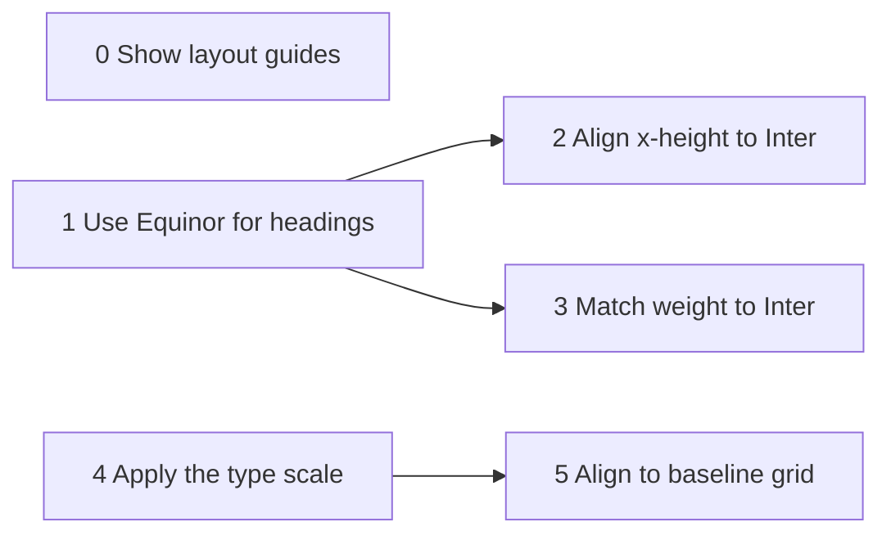

# Typography demo — intent

Decisions for the typography artefact shown in part one of the Into Design
Systems talk, Oslo, 9 September 2026. Settled in an interview on 2 September
2026. The source of the artefact lives in this directory; this file records
what it is for and what must stay true of it, so that building it does not
quietly re-open any of these.

## 1. What it is

A card of text: heading, subheading, lead paragraph, paragraphs, a subheading
between paragraphs, more paragraphs. Beside it, a panel of controls, each
labelled with the request a user would type to an agent, and a code panel
showing the CSS that request emits. Toggling a control changes the text and
the code together.

**The CSS is the artefact. The text is its preview.** If the audience only
sees text move, the demo proves that x-height alignment and a baseline grid
are worth doing, and nothing about skills. The talk's claim is about skills.

There is no live demo. The story is: these are the problems we faced, this is
how we solved them, here is how you do the same. One live run at the end is a
bonus if time allows, never a dependency.

## 2. The "before" state

Browser defaults, nothing else. Inter for everything, 16px body, `h1` at 2em,
`h2` at 1.5em, `h3` at 1.17em, `h4` at 1em, `line-height: normal`. This is
what a page looks like when a developer does nothing, and every reset starts
from it, so nobody in the room can call it contrived. Hand-picked "random"
heading sizes were rejected as a strawman.

The Equinor face is declared by the demo's own `@font-face`, pointing at the
woff2 on `cdn.eds.equinor.com`. The CDN's own stylesheet is not imported: its
Equinor declaration already applies a `size-adjust`, which would leave the
x-height toggle with less to show. The font file is **referenced, never
bundled** in this repository. Its licence permits use by Equinor and its
suppliers and forbids redistribution; serving from a third-party pen is
established practice, committing the file here is not.

## 3. The sequence

Toggles are shown in this order and told in this order. A toggle that depends
on another is disabled until its dependency is on, so no reachable state is
meaningless.

| # | Control                                   | Enabled when              |
|---|-------------------------------------------|---------------------------|
| 0 | Show layout guides (4px grid)             | always                    |
| 1 | Apply the type scale                      | always                    |
| 2 | Align text to the baseline grid           | 1 is on                   |
| 3 | Use Equinor for headings                  | always                    |
| 4 | Align the x-height of Equinor to Inter    | 3 has been on once        |
| 5 | Match Equinor's weight to Inter           | 3 has been on once        |

Revised 5 September after seeing the page: this is the telling order (grid,
scale, baseline, then the problem and its two fixes). Controls 4 and 5 unlock
the first time the headings are set in Equinor and *keep their state* when
Equinor is toggled off again; their effect is gated in the CSS on the swap,
and the code panel says "on, but the headings are in Inter" meanwhile, so the
face can be switched back and forth with the fixes in place — the comparison
worth showing. Nothing animates.

Dependencies, as the enable rules above express them:



Step 1 is the problem: the headings look smaller and thinner, because the two
faces share neither x-height nor stem weight at the same nominal size. Steps
2 and 3 are the `typography-x-height-alignment` and
`typography-weight-matching` skills. Step 4 is `typography-scale`. Step 5 is
the spacing skill not yet written; the demo is that skill's worked example,
not a hard-coded stand-in for it.

**Weight is matched at the tier and size the headings are set at** (5
September). Browser-default headings are bold, 700, and Inter 700 has a stem
no weight on Equinor's 300–700 axis reaches, so with the scale off the weight
toggle holds at 700 and the code panel shows the skill's warning rather than
pretending. The scale sets headings at the bolder tier, Inter 600, and the
match is taken per heading size with Inter's `opsz` following the size and
the x-height correction taken at that same `opsz`: `h1` 5xl 680.7, `h2` 3xl
671.6, `h3` 2xl 667.7 (the full 300 / 400 / 600 table across the ramp is in
`demo.js`; measured 8 September with `xheight.py Inter.woff2 --location
wght=400,opsz=<px>` for the step's correction and `stem.py Inter.woff2
EquinorVariable-VF.woff2 --match 300,400,600 --opsz <px> --correction <that>`
per step). Holding an unreachable tier at the axis maximum is the demo's
choice; the skill reports null. The bolder values rise with size: Inter's
optical axis thins its stems, but it also lowers its x-height, so Equinor is
set smaller at the large steps and needs more weight to keep up; at the normal
tier the two effects cancel and 458.5 holds at every step. Deep links apply
controls in order: `index.html?on=guides,scale,baseline,swap,xheight,weight`.

**The x-height correction is one number per step, not per family** (8
September, from the bot's review of the overlay demo, #33). Inter's `opsz`
axis lowers its x-height as the size grows: `OS/2.sxHeight` 0.545898 at opsz
14 and 0.515625 at opsz 32, confirmed against the outlines of x v w z and
against Chrome's `measureText` at 14 / 32 / 48px; Equinor's is flat along its
axis. The drift is 5.5%, well past the x-height skill's 1–2% tolerance, so
the demo takes the skill's second outcome (`references/optical-size.md`):
each display step is baked with the correction measured at its own px —
2xl × 1.112875 → 23.5px, 3xl × 1.100667 → 27px, 5xl × 1.074219 →
34.5px, against 24 / 28 / 36.5 with the flat factor — and the browser-default
headings get theirs at 32 / 24 / 18.72px. Until 7 September every heading
used the text step's × 1.137288 and was about 6% too large by x-height
parity.

Each control's label is the request itself, in the wording of the skill's
representative requests, for example "Align the x-height of Equinor and
Inter, Inter is the master". The code panel shows the CSS that request emits.

## 4. Honesty rules

These are the conditions under which the artefact is allowed to fake
anything.

- **The code panel shows whatever is running.** Not an idealised version.
  Anyone who opens devtools on the published artefact finds what the panel
  showed.
- **No animation, and the baked branch rather than `size-adjust`** (revised
  5 September). The page is a visualisation of the solution, and the two-ramp
  branch — display size = text size × the step's correction, re-snapped to
  the half-pixel grid — is what EDS ships for Figma and React Native parity,
  and the only branch that can carry a per-step correction at all, so it is the
  CSS that runs and the CSS the panel shows. Before the scale is applied the
  browser's em sizes are multiplied as they are, and the panel says so. The
  earlier plan, a simulated size animating into a `size-adjust` rest state,
  was built, measured geometrically identical, and dropped as not worth the
  explanation.
- **No simulated agent replies.** A terminal that types a prompt and
  "produces" CSS is a fake of the very thing the talk claims, and no one in
  the room can tell it from the real thing. The prompts on the card are the
  real requests. The CSS is copied from a real run and dated. The reply is
  not performed.
- **The card is not draggable.** Dragging demonstrated nothing about
  typography and cost a paragraph of explanation. Dropped.
- **The claims are measured in the page itself.** `index.html?measure`
  applies the scale, the swap, the x-height and the weight, then prints each
  block's family, size, weight and first baseline modulo 4 with the grid
  toggle off and on. Off: remainders 2, 1, 3, 2. On: 0.00 for `h1` and `h2`,
  3.98 for `h3` and the paragraphs, a 0.02px rounding of `1ex` (re-run 8
  September with the per-step display sizes 34.5 / 27 / 23.5).
- **The code panel never claims less than is running.** When a control goes
  off, the panel falls back to the last control in the telling order that is
  still on, and to the browser-default text only when nothing is.

## 5. The baseline mechanism

Every text element in flow snaps, headings included. The distinction is not
"read versus scanned"; it is text in flow versus a label inside a control
whose height is fixed by the control. A heading inside a header region with
its own inset follows the table-cell pattern, inset plus baseline padding,
not the button pattern.

The recipe is the one already shipped in `elements.css` in
`equinor/design-system`, and the one the token build in the meetup repo
emits:

```css
:root {
  --eds-padding-top-baseline:    calc(round(1cap, 0.25rem) - 1ex);
  --eds-padding-bottom-baseline: 0px;
}

:where(h1, h2, h3, h4, h5, h6, p, li, dt, dd, blockquote, figcaption) {
  @supports (text-box: trim-both ex alphabetic) {
    padding-top:    var(--eds-padding-top-baseline);
    padding-bottom: var(--eds-padding-bottom-baseline);
    text-box: trim-both ex alphabetic;
  }
}
```

Why this and not the two alternatives considered:

- The pen's half-and-half split (`(1lh − round(1cap, 4px)) / 2` above and
  below) only lands because a button's own padding absorbs the offset. In
  flow there is no outer padding to reduce, and the first baseline lands two
  pixels off the grid for both 14/16 and 16/24.
- "All the remainder on top" (`padding-top: calc(1lh − 1cap)`, no bottom
  padding) does land, but leaves a full line-height of headroom above the
  first line, so the space between blocks is the flow margin plus that
  headroom.

The shipped recipe trims to x-height, pads the top up to the *rounded* cap,
and puts nothing below. A block is (n−1) line-heights plus one rounded cap
tall, its first baseline sits at the rounded cap from its top, and it ends on
its last baseline. The distance between blocks is exactly the flow-space
token, measured baseline to cap top. Trimming to `ex` rather than `cap` keeps
the top padding positive whichever way the cap rounds.

Per-element `1cap` and `1ex` mean the padding recomputes on its own when the
heading font swaps and when its size grows after x-height correction. Line
heights, flow margins and container padding are multiples of 4px; borders are
inset shadows so they take no layout space.

### Why the trim is not optional for the heading face

Measured in headless Chrome on 2 September 2026, how far the cap sits from
centred in a plain, untrimmed line box. Negative is high.

| face                   | 14/20 | 16/24 | 24.5/32 | 32/36 | 37/40 |
|------------------------|-------|-------|---------|-------|-------|
| Inter                  | −0.1  | +0.2  | +0.1    | −0.6  | −0.5  |
| Equinor, size-adjusted | −0.7  | −1.5  | −1.9    | −3.0  | −3.0  |

Inter's vertical metrics are symmetric about the cap centre (0.605 em each
side), so centring the line box centres the cap, and the half-leading
approximation used for controls is exact. Equinor sets `USE_TYPO_METRICS`
with an ascender of 0.788 em and a descender of 0.212 em; its cap centre
sits 0.062 em above the line-box centre, up to three pixels at heading
sizes, three quarters of a grid cell. So headings go through the trim path.
`text-box` is in Chrome 133, Safari 18.2 and Firefox 154 (18 August 2026; per
caniuse and the Firefox release calendar, checked 4 September), so every
current evergreen browser has it, and an older one falls through the
`@supports` gate to untrimmed text with Equinor headings visibly off the
guides while Inter paragraphs stay on. The grid toggle's story can say so in
one sentence.

## 6. Guides

Pure CSS, from the existing pen: a `::after` on the container carrying
repeating linear gradients, inset by the container's padding so that guides
and text share an origin. The container padding must be a multiple of 4px.

## 7. Take-home

The closing beat is "you can do the same". The card carries both a URL and
the install command:

```bash
npx skills add equinor/skills --skill typography-scale
```

The message is that the question of whether designers should code is over:
Claude Code runs in the desktop app, no terminal required. The skills emit
CSS and DTCG tokens today. Baseline alignment is CSS-only and is presented as
such: Figma cannot do it with text styles, and that is a fact about Figma,
not a ceiling for CSS.

## 8. Open before 9 September

- **Figma step in `typography-scale`** (#22). Committed on 2 September: the
  scale's DTCG output becomes Figma variables and text styles through the
  Figma MCP, with the x-height skill's baked branch feeding it. Needs a
  fresh-session test before the talk, per the authoring gates in `CLAUDE.md`.
- **Wrapped labels in controls.** The optical-padding guidance in the meetup
  repo says a wrapped button label still uses the centred recipe;
  `button.css` in `equinor/design-system` gives wrapped labels the baseline
  padding. Reconcile before the demo inherits one of them.
- **Spacing skill.** Baseline alignment, flow spacing and the inset patterns
  above belong to it. This demo is its fixture.
- **Per-step corrections in the scripts** (8 September). `scale.py` takes one
  `--correction` and cannot emit the per-step display ramp this demo runs;
  `stem.py --opsz` pins the reference's axis but not the target's, which the
  overlay demo's Equinor → Inter pairing needs. Both are follow-ups in their
  skills; until then the per-step numbers here are produced by running the
  two scripts once per step, as `demo.js` records.
